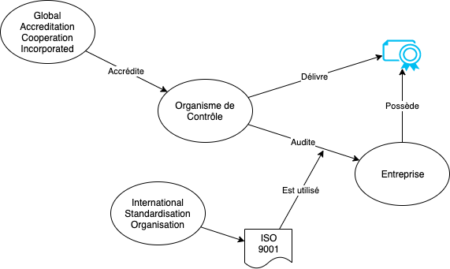

# Séquence des 25 et 27 mars 2026

### ECOE

- On va revenir sur les notions de base d'économie avec un Kahoot

### ISO 9000/9001

- Introduction à partir du site [iso.org](https://www.iso.org/fr/standard/45481.html)
- Principe de certification
  - Des organismes de certification (OC) externes et indépendants sont accrédités par un membre du [Global Accreditation Cooperation Incorporated](https://globalaccreditationcooperationincorporated.org/) pour garantir la reconnaissance internationale
  - Une entreprise mandate un OC, qui effectue un audit, à l'issue duquel il délivre - ou pas - la certification
  - La certification doit être revalidée tout les X années (dépend du type de certification)
 

- Importance d'une certification
  - Reconnaissance international indisputable
  - Est souvent nécessaire selon les domaines et l'ampleur des contrats

### Définition des rôles

Les rôles qui doivent être établis dans chaque entreprise:
- CEO
- CFO
- Responsable des stocks
- Ouvrier de manufacture
- Ressources humaine
- Commercial

### Revue des objectifs (issues)

- Chacun s'attribue une et une seule story qu'il met en "in Progress"
- L'action de mettre en "in Progress" tient lieu de signature: celui qui le fait est sûr à 100% de ce qui doit être fait

### Affinage produit / ERP

- Votre GED est en place
- Tous vos documents de travail relatifs à votre entreprise sont stockées dans votre GED
- Aller à la découverte d'Odoo avec ScaleUp

(vendredi)

### Introduction BPMN

- (tbd)
